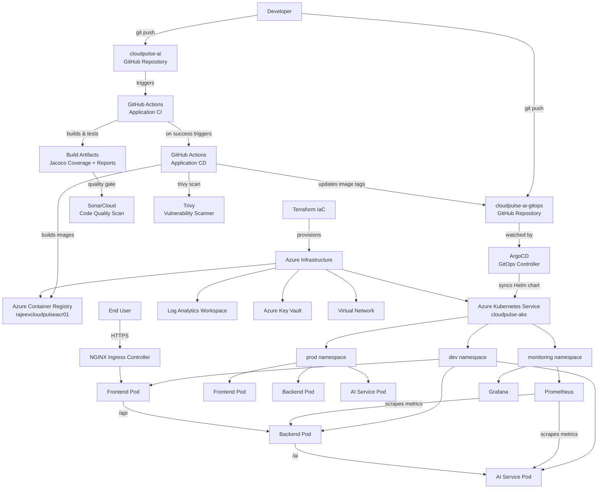

# Solution Architecture

## Overview

CloudPulse AI follows a modern cloud-native architecture built around microservices, GitOps, and declarative infrastructure. The system is split into two primary planes:

- **Data Plane** — the running application on AKS (Frontend, Backend, AI Service)
- **Control Plane** — the tooling that manages deployments (GitHub Actions, ArgoCD, Terraform)

---

## High-Level Architecture Diagram



---

## Request Flow (Runtime)

```
User Browser
    │
    ▼
NGINX Ingress Controller  (path: /)
    │
    ▼
Frontend Service          (React SPA, port 80)
    │
    ▼  HTTP /api/*
Backend Service           (Spring Boot, port 9090)
    │
    ▼  HTTP /ai/*
AI Service                (FastAPI, port 8000)
    │
    ▼
Incident Analysis Response (JSON)
```

All inter-service communication is **internal to the AKS cluster** via Kubernetes ClusterIP services.

---

## CI/CD and GitOps Flow

```
Developer Push
    │
    ▼
GitHub Actions CI
  ├─ Build frontend (Node/Vite)
  ├─ Build backend (Maven)
  ├─ Build AI service (Python/pytest)
  ├─ SonarCloud quality gate
  └─ Docker build validation
    │
    ▼ (on CI success)
GitHub Actions CD
  ├─ Build and push Docker images → ACR
  ├─ Trivy vulnerability scan
  ├─ Verify images in ACR
  └─ Update image tag in GitOps repo (values-dev.yaml / values-prod.yaml)
    │
    ▼
ArgoCD detects change in GitOps repo
    │
    ▼
ArgoCD syncs Helm chart to AKS
    │
    ▼
Rolling deployment in AKS namespace
```

---

## Infrastructure Architecture

```
Azure Subscription
└── Resource Group: rajeevsingh
    ├── Virtual Network (cloudpulse-vnet)
    │   └── Subnet (cloudpulse-subnet)
    ├── Azure Kubernetes Service (cloudpulse-aks)
    │   └── System Node Pool
    ├── Azure Container Registry (rajeevcloudpulseacr01)
    ├── Log Analytics Workspace
    ├── Azure Key Vault
    └── Storage Account (Terraform remote state backend)
```

---

## Component Responsibility Matrix

| Component | Owned By | Responsibility |
|---|---|---|
| Frontend | Application Repo | User interface, incident submission |
| Backend | Application Repo | REST API, business logic, metrics |
| AI Service | Application Repo | Incident classification, root-cause analysis |
| Helm Chart | GitOps Repo | Deployment packaging |
| ArgoCD Apps | GitOps Repo | Sync desired state to cluster |
| Prometheus + Grafana | GitOps Repo | Metrics collection and visualization |
| AKS, ACR, VNet, Key Vault | Application Repo (Terraform) | Cloud infrastructure |
| CI/CD Workflows | Application Repo | Automation |

---

## Network Architecture

| Component | Exposure | Port | Protocol |
|---|---|---|---|
| Frontend | External via Ingress | 80 | HTTP |
| Backend API | Internal + Ingress `/api` | 9090 | HTTP |
| AI Service | Internal + Ingress `/ai` | 8000 | HTTP |
| Prometheus | Internal (monitoring ns) | 9090 | HTTP |
| Grafana | Internal (monitoring ns) | 3000 | HTTP |

---

## Security Architecture

- **No static credentials in Git** — all secrets sourced from Azure Key Vault via CSI Driver
- **Managed Identity** — AKS node pool uses system-assigned managed identity for ACR image pull
- **Trivy scanning** — every Docker image is scanned for CVE vulnerabilities before deployment
- **SonarCloud** — static code analysis on every pull request and main branch push
- **RBAC** — Kubernetes namespaces isolate dev and prod workloads

---

*Previous: [Project Overview](01-project-overview.md) | Next: [Infrastructure Provisioning](03-infrastructure.md)*
