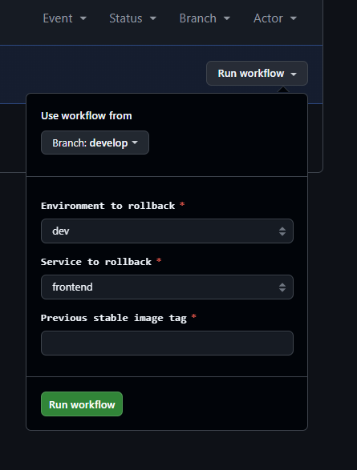
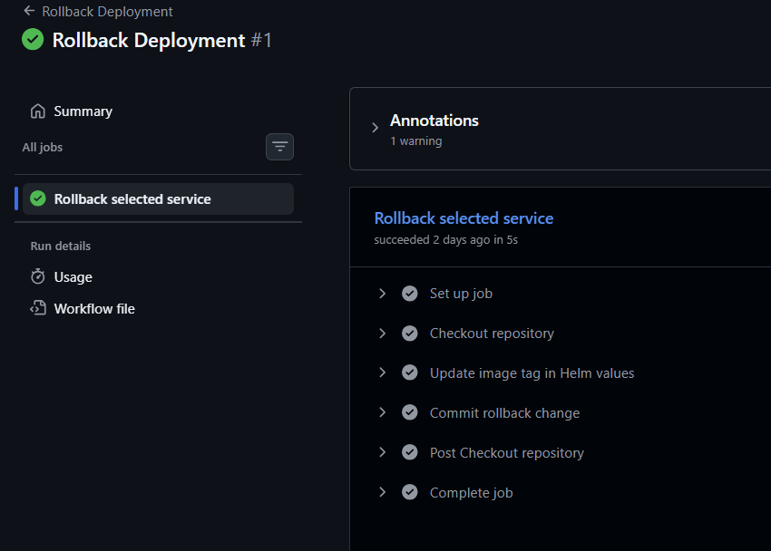

# Rollback Strategy

## Overview

CloudPulse AI implements a **GitOps-native rollback strategy**. Because Git is the single source of truth, rolling back a deployment means reverting the image tag in the GitOps repository. ArgoCD detects the change and redeploys the previous version automatically.

> **Important distinction:**
> ArgoCD **self-heal** restores the cluster to the *current Git state*. It is not a rollback.
> A rollback means changing the Git state to a *previous version*, which then flows through the same GitOps pipeline.

---

## Rollback Workflow

```
Engineer identifies a bad deployment
        │
        ▼
Triggers rollback workflow on GitHub Actions
  (provides: environment, service, previous tag)
        │
        ▼
GitHub Actions updates Helm values file
  e.g., values-dev.yaml:
    aiService.image.tag: dev-28  ←  reverted from dev-29
        │
        ▼
Commit pushed to cloudpulse-ai-gitops repository
        │
        ▼
ArgoCD detects the new commit
        │
        ▼
ArgoCD syncs: deploys the previous image version to AKS
        │
        ▼
Kubernetes performs rolling update
  (new pods with old image start first,
   then old pods with broken image are terminated)
        │
        ▼
Application is restored to the previous stable version
```

---

## Rollback GitHub Actions Workflow

The rollback is fully automated via a manually triggered GitHub Actions workflow in the **GitOps repository**:

```yaml
# .github/workflows/rollback.yml
name: Rollback Deployment

on:
  workflow_dispatch:
    inputs:
      environment:
        description: "Environment to rollback"
        type: choice
        options: [dev, prod]
      service:
        description: "Service to rollback"
        type: choice
        options: [frontend, backend, aiService]
      image_tag:
        description: "Previous stable image tag"
        required: true
```

### How to Trigger a Rollback

1. Navigate to `cloudpulse-ai-gitops` on GitHub
2. Go to **Actions** → **Rollback Deployment**
3. Click **Run workflow**
4. Fill in the inputs:
   - **Environment:** `dev` or `prod`
   - **Service:** `frontend`, `backend`, or `aiService`
   - **Image tag:** The previous stable tag (e.g., `dev-27`)
5. Click **Run workflow**

The workflow runs automatically and the rollback is live within 1-2 minutes.

---

## Rollback Internals

The workflow uses `yq` to update the YAML values file:

```bash
VALUES_FILE="helm/cloudpulse/values-${environment}.yaml"
yq -i ".${service}.image.tag = \"${image_tag}\"" "$VALUES_FILE"

git config user.name "github-actions"
git config user.email "github-actions@github.com"
git add "$VALUES_FILE"
git commit -m "rollback(${environment}): ${service} to ${image_tag}"
git push
```

The commit message follows a consistent convention: `rollback(env): service to tag`.

---

## Finding the Previous Stable Tag

Image tags follow the format `{env}-{run_number}`. To find the last stable tag:

```bash
# List tags in ACR for a specific repository
az acr repository show-tags \
  --name rajeevcloudpulseacr01 \
  --repository cloudpulse-backend \
  --orderby time_desc \
  --output table
```

Alternatively, check the **Git commit history** of the GitOps repository:

```bash
git log --oneline helm/cloudpulse/values-dev.yaml
```

The commit history shows every image tag update, making it easy to identify the last known good version.

---

## Rollback Scope

| Scope | How |
|---|---|
| Single service | Select the specific service in the rollback workflow |
| All services at once | Run the rollback workflow 3 times (once per service) |
| Full environment | Revert the entire `values-{env}.yaml` via `git revert` |
| Infrastructure | Run Terraform with the previous configuration |

---

## ArgoCD Manual Rollback (Alternative)

ArgoCD supports rolling back to a previous deployed version via its UI or CLI. However, this is **not the recommended approach** because it bypasses Git and creates drift.

```bash
# View history of an ArgoCD application
argocd app history cloudpulse-dev

# Rollback to a specific revision (not recommended for production)
argocd app rollback cloudpulse-dev <revision-id>
```

> **Note:** ArgoCD rollback only reverts the Kubernetes resources — it does not update the values file in Git. On the next sync, ArgoCD will re-apply the Git state (the newer broken version). Always use the GitHub Actions rollback workflow for durable, audited rollbacks.

---

## Rollback Decision Matrix

| Scenario | Action |
|---|---|
| Bad image in dev | Rollback workflow on dev, fix code, push new deployment |
| Bad image in prod | Immediate rollback workflow on prod, investigate, fix in dev first |
| Infra change broke cluster | Revert Terraform change, re-run `terraform apply` |
| ConfigMap / Secret issue | Fix in GitOps repo and commit, ArgoCD syncs automatically |
| All pods in CrashLoop | Check logs, rollback image, then fix and re-deploy |

---

## Rollback Audit Trail

Every rollback generates:

1. A GitHub Actions run with inputs visible in the audit log
2. A Git commit in the GitOps repository with message `rollback(env): service to tag`
3. An ArgoCD sync event with the reason and resource diff

This provides a complete, time-stamped audit trail of every rollback event.

---

## Screenshots

**GitHub Actions rollback workflow dispatch form**


**Rollback workflow completed successfully**


---

*Previous: [Monitoring and Logging](07-monitoring-logging.md) | Next: [Challenges and Resolutions](09-challenges-and-resolutions.md)*
