# Documentation Images

All screenshots referenced across the CloudPulse AI documentation.

---

## Terraform / Infrastructure

**GitHub Actions Terraform workflow successful run**
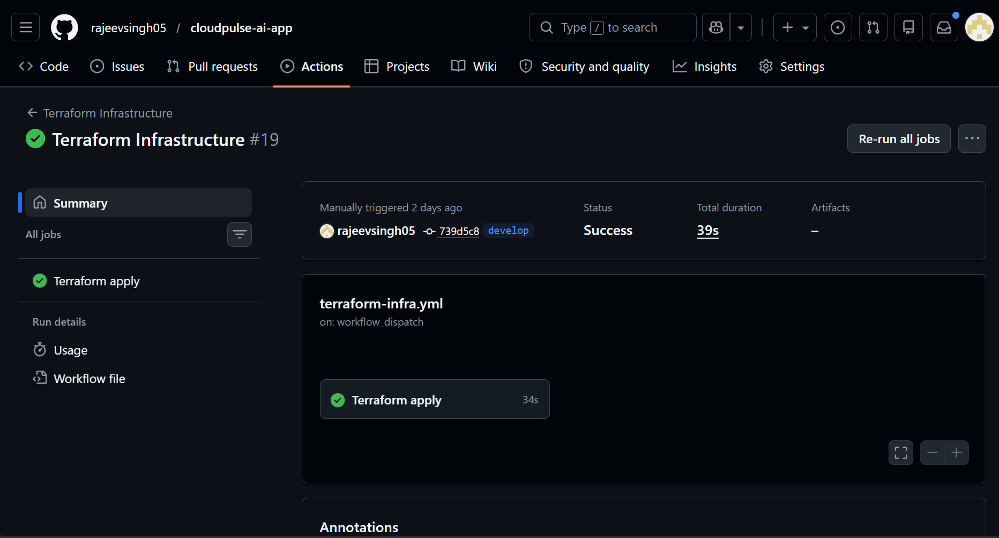

**Azure Portal resource group `rajeevsingh` showing all resources**
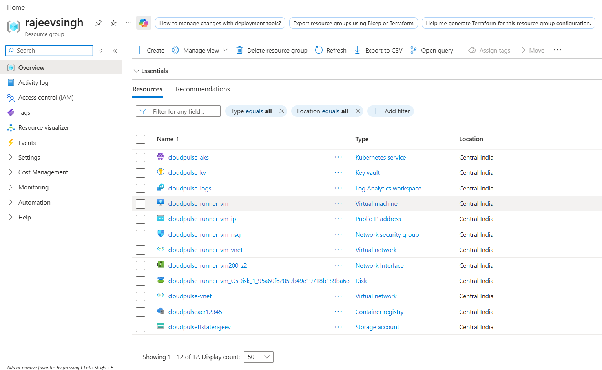

**ACR showing all three image repositories**
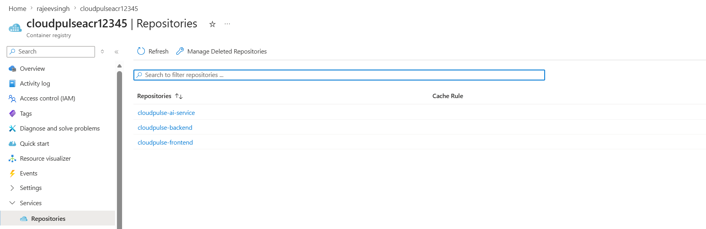

**Azure Storage Account showing `tfstate` container**
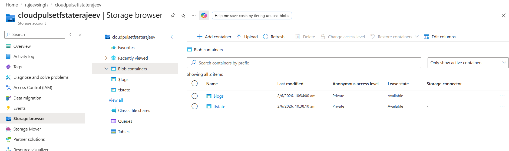

---

## CI/CD Workflows

**Application CI workflow run succeeded**
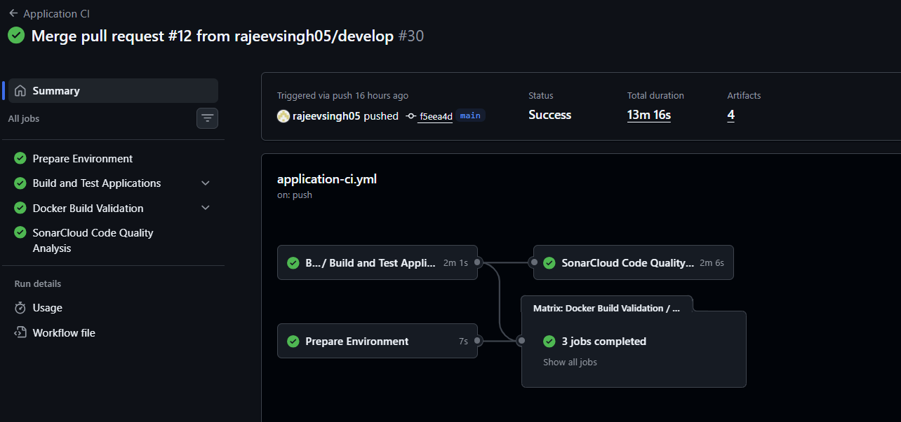

**Application CD workflow run succeeded**
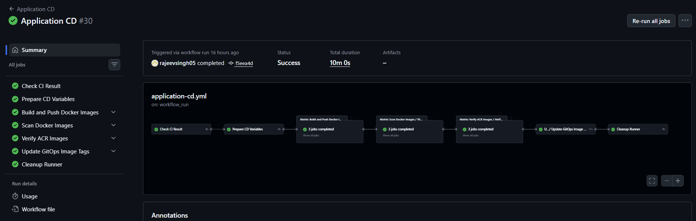

**SonarCloud quality gate passed**
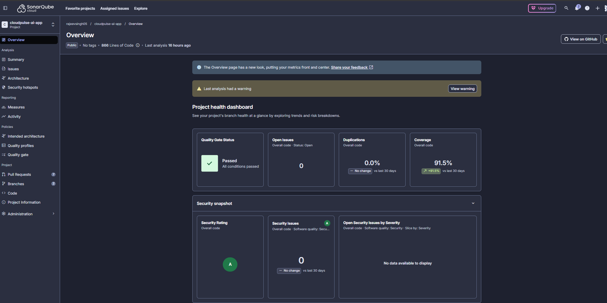

**ACR showing `dev-*` and `prod-*` image tags**
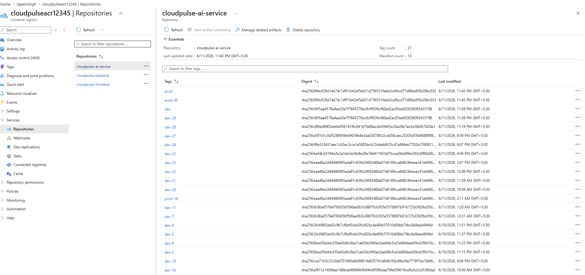

**Automated commit in GitOps repo updating `values-dev.yaml`**
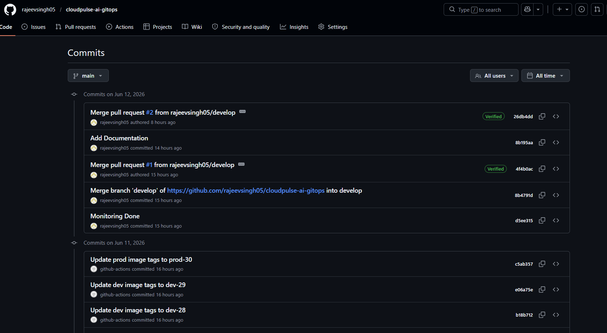

---

## ArgoCD / GitOps

**ArgoCD `cloudpulse-dev` app Synced + Healthy**
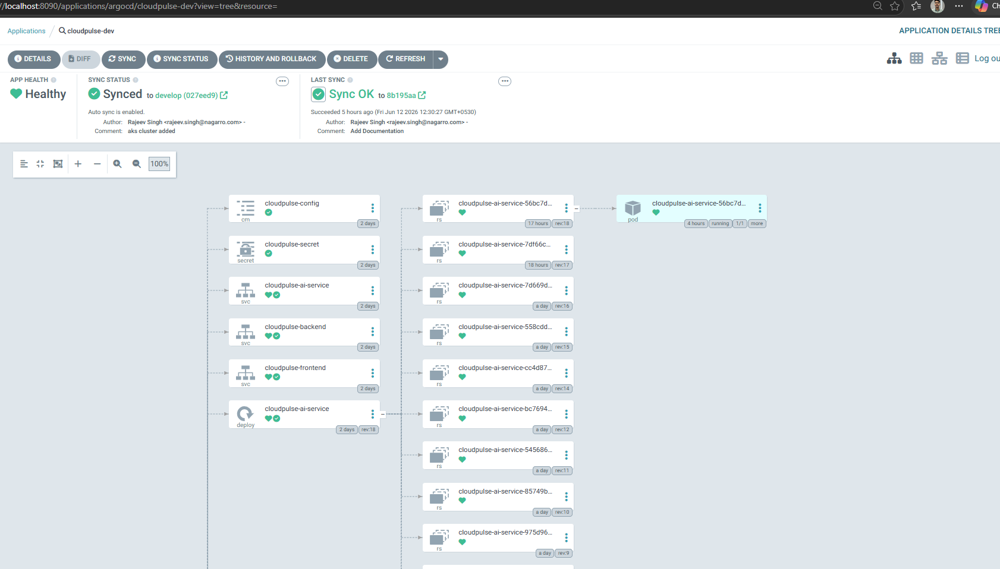

**ArgoCD `cloudpulse-prod` app Synced + Healthy**
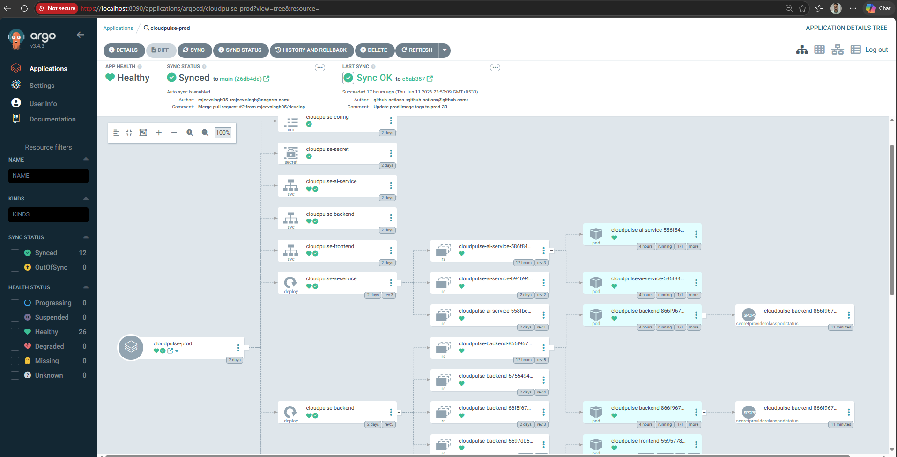

**ArgoCD monitoring app Synced**
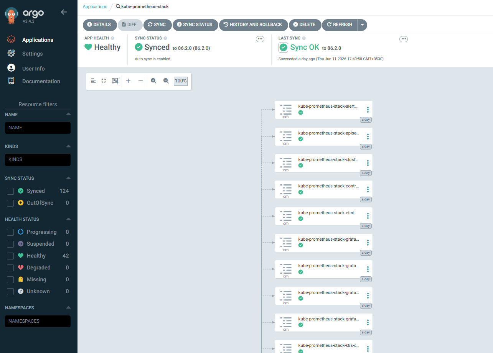

**ArgoCD application resource tree (pods, services, ingress, HPA)**
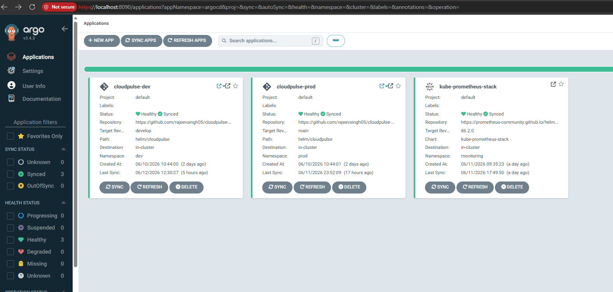

---

## Monitoring

**Prometheus Targets page showing `cloudpulse-backend` and `cloudpulse-ai-service` as UP**
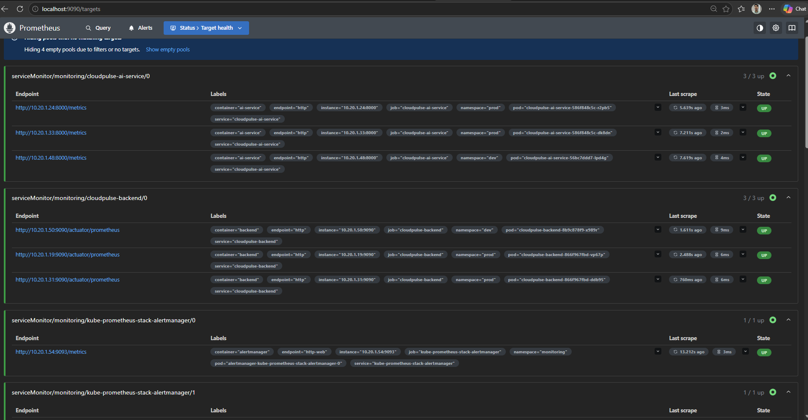

**Grafana CloudPulse AI dashboard with live data**
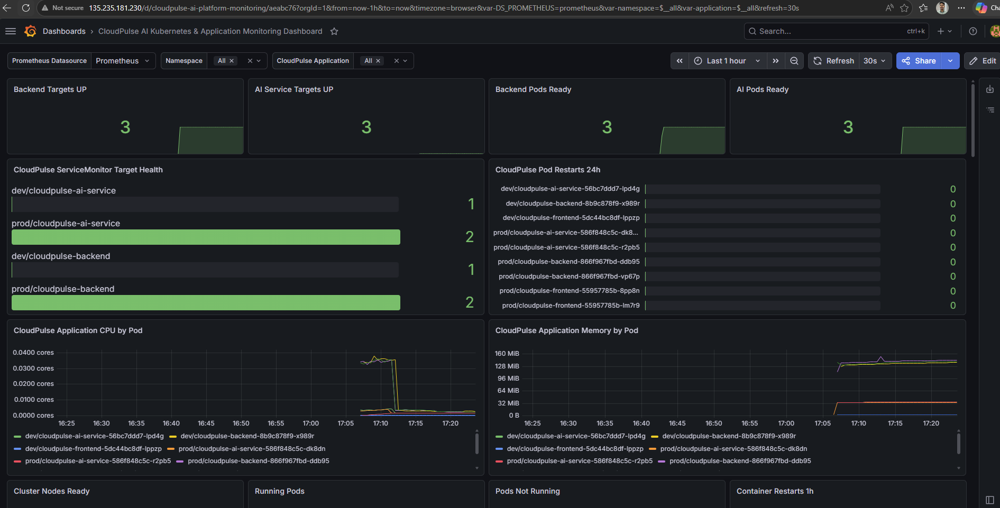

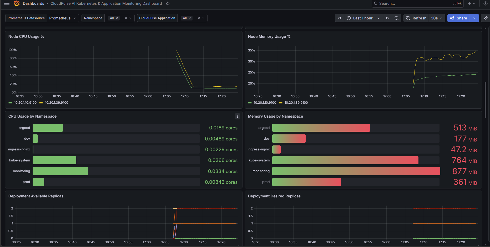

**`kubectl get pods -n monitoring` output**
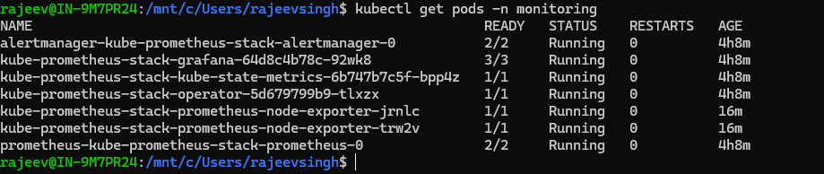

---

## Rollback

**Rollback workflow dispatch form**

**Rollback workflow completed successfully**

---
